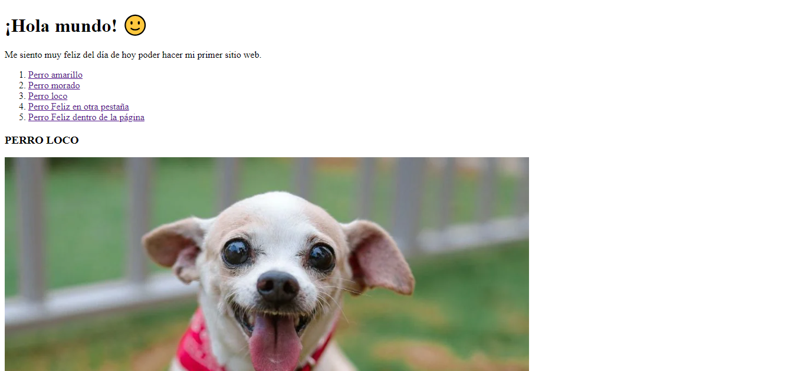

# Mi primer página web de Tecnolochicas PRO

Esta página web fue desarrollada para comenzar a utilizar HTML dentro del Bootcamp de desarrollo front-end de Tecnolochicas.

Fue desarrollado con HTML.

[Proyecto en línea](https://moonlit-paprenjak-dabd7f.netlify.app/)

- Capturas de pantalla

- Tecnologías

* HTML

- Creado por Maria Xitlali Valenzo Serna en el bootcamp de Tecnolochicas Pro